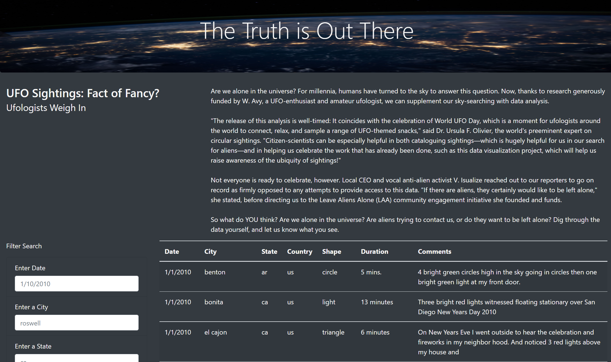
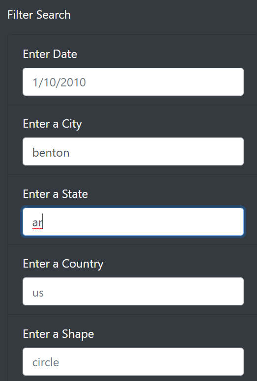
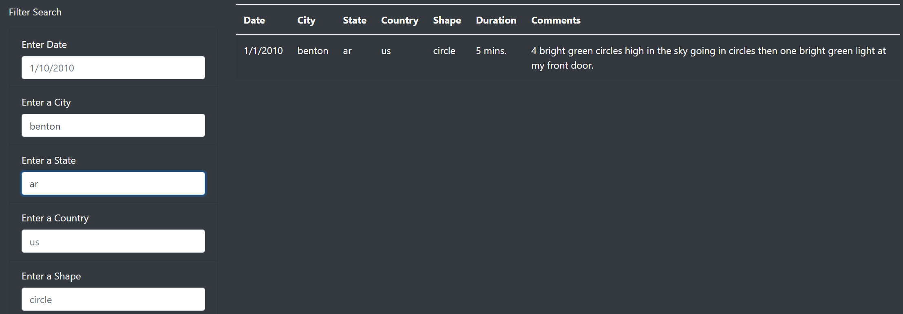
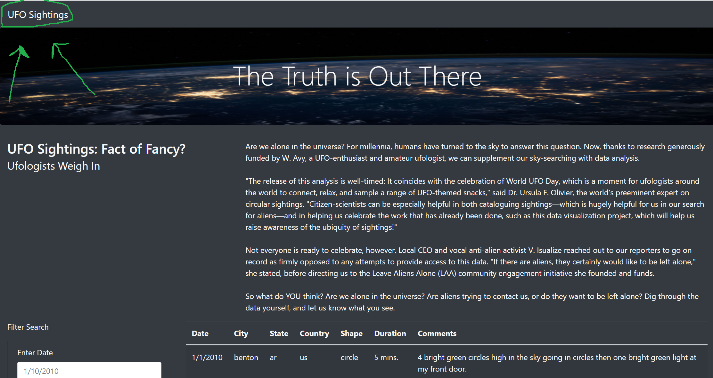

# UFOs
---
## Overview of the Project
---
### Purpose
The purpose of the final web app is to store data on UFO sightings. Further, the webpage is also a central location for users to query the database on a multitude of filters. 

### Details
The data used to store, sort, query, and present the UFO sighting information is stored as a JavaScript array. On the front end, the data is presented to the user as a table. The table is very dynamic; capable of being queried on any combination of five different filters as per the users' selection.

---

### Programming Languages and other Software Used
* JavaScript, HTML, Bootstrap, CSS, and VS Code
---
## Results
The primary objective of this project was to build a dynamic webpage; enabling user interaction on a variety of table filter search criteria including: date, city, state, country and/or shape. Once the user has selected a combination of filters and input their specific filter criteria into the designated filter boxes, the web page will dynamically return all of the data matching the user's inputs and display only that data in the table. The image below displays what the webpage will look like before any filters have been applied to the table: 

Next, the image below depicts an example of what a user could input into the search filters: 

Once the user inputs his/her desired search criteria, he/she will simply have to press the enter key on their keyboard for the web page to present the associated results, like so: 

Then, if the user wishes to perform another search, he/she has two options. The first option is to navigate to the top left corner and click on the text, "UFO Sightings" as the green arrows in the below image are pointing to:

Lastly, the user's second option is to reload their web-browser. Both of these options will result in the default table being displayed as well as cleared filters, thereby allowing the web page to perform a new query once the above steps are followed again. 

---

## Summary
In my opinion, one drawback of the webpage is its lack of dynamic content. To elaborate, although the webpage itself is dynamic in the sense that it can ingeract with a user's inputs, the actual data stored in the webapp is static, meaning it is never being updated with potential new UFO sightings.

Additional Recommendations:
* Alter the JS script so that the date filter can not only be filtered by all dd/mm/yyyy, but any combination of that. For example, only "2008". 
* Removing bootstrap's case sensitivity currently acting on the filter criteria.
* Updating the webapp to constantly scrape new data.
